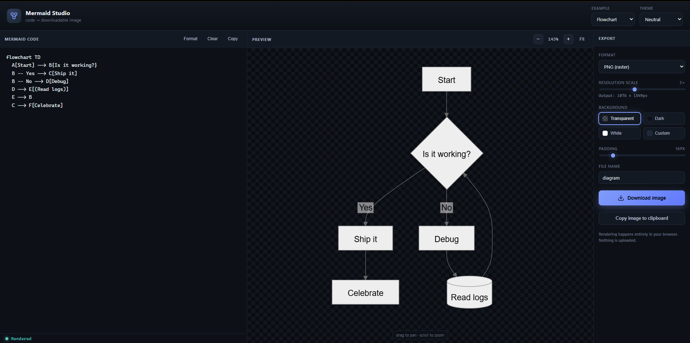
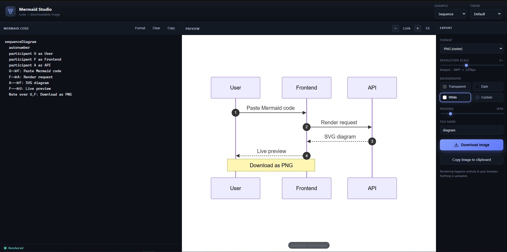

# Mermaid Studio — code → downloadable image

A self-contained, dark-themed web app that turns [Mermaid](https://mermaid.js.org/) diagram
code into a downloadable **PNG**, **JPEG**, or **SVG**. Everything runs in the browser — no
backend, no uploads.

 

## Screenshots

| Dark theme · transparent background | Sequence diagram · white background |
| :---: | :---: |
|  |  |

## Features

- **Live preview** with 250 ms debounced re-render; the last good diagram stays on screen while you fix syntax errors.
- **Drag to pan, scroll to zoom** (pointer + touch), plus zoom buttons, **Fit**, and double-click-to-fit.
- **Export to PNG / JPEG / SVG.** Raster export rasterizes the SVG onto a canvas at a selectable **1×–6×** resolution scale (the output pixel size is shown live, and auto-capped if it would exceed browser canvas limits).
- **Background control** — transparent, dark, white, or a custom color picker.
- **Adjustable padding** around the diagram (0–120 px).
- **Copy image to clipboard** (PNG) where the browser supports it.
- **10 built-in examples** (flowchart, sequence, class, state, ER, gantt, pie, mindmap, journey, git graph).
- **5 render themes** (dark, default, neutral, forest, base).
- **Your work is remembered** — code + settings persist in `localStorage`.
- Format/clear/copy code helpers and a tab-inserts-spaces editor.

## Run it

### Docker (recommended)

Served by nginx on an uncommon host port (**8473**) chosen to avoid clashing with the
usual dev ports:

```bash
docker compose up -d --build
# open http://localhost:8473
```

Pick a different port without editing any file:

```bash
MERMAID_PORT=12345 docker compose up -d --build   # http://localhost:12345
```

Stop it with `docker compose down`.

### Static server (no Docker)

It's a plain static site — any HTTP server works (the ES-module import of Mermaid from the
CDN needs `http://`, not `file://`):

```bash
npx http-server -p 4321 -c-1
# then open http://localhost:4321
```

> **Internet note:** Mermaid itself is loaded from a CDN at runtime (with jsdelivr →
> unpkg → esm.sh fallbacks). If all CDNs are unreachable, the app shows a clear error
> with a **Retry** button. Your diagrams are never uploaded — all rendering and export
> happen in the browser.

## How the PNG export works

Mermaid renders to inline `<svg>`. To rasterize it cleanly:

1. **Labels are rendered as native SVG `<text>`** (`htmlLabels: false`). Mermaid's default
   HTML-in-`<foreignObject>` labels **taint the canvas** cross-origin, which makes
   `canvas.toBlob()` throw a `SecurityError` — so they're disabled.
2. The SVG is given explicit pixel `width`/`height`, an optional background `<rect>`, and padding via the `viewBox`.
3. It's serialized, loaded into an `Image`, and drawn onto a `<canvas>` sized at `dimensions × scale`.
4. `canvas.toBlob('image/png' | 'image/jpeg')` produces the downloadable file. SVG export skips the canvas and downloads the serialized vector directly.

## Error & edge-case handling

The app is built to fail loudly but never crash:

- **CDN failure** → blocking overlay with a Retry button; three CDN sources are tried in order.
- **Invalid syntax** → error card with the parser message; the previous good diagram stays visible.
- **Render hangs** → 20 s timeout on parse/render/rasterize.
- **Oversized output** → export scale is auto-capped to stay within canvas limits (16384 px / 256 MP); if even 1× is too big, you're told to use SVG.
- **Tainted canvas** → avoided by design (native SVG `<text>`, not HTML labels); `toBlob` failures are caught and surfaced.
- **Clipboard** → feature-detected, with focus/permission errors translated to plain advice.
- **Bad filenames** → sanitized (illegal/control chars stripped, extension normalized, empty → `diagram`).
- **Storage** → `localStorage` reads/writes are wrapped; corrupt or disabled storage is ignored.
- **Global nets** → `unhandledrejection` / `error` listeners and a per-handler `guard()` wrapper.

## Files

| File | Purpose |
|------|---------|
| `index.html` | Markup & layout |
| `styles.css` | Dark theme |
| `app.js` | Mermaid load/init, live render, pan/zoom, export pipeline, error handling |
| `Dockerfile` | nginx static-server image |
| `nginx.conf` | MIME types (incl. `.mjs`), gzip, caching |
| `docker-compose.yml` | Runs on host port 8473 (override via `MERMAID_PORT`) |
